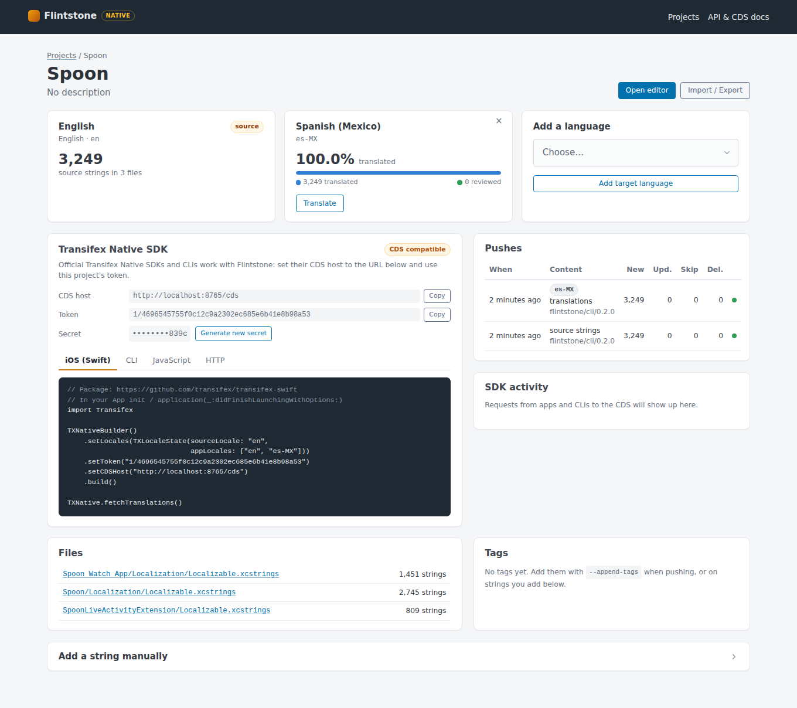
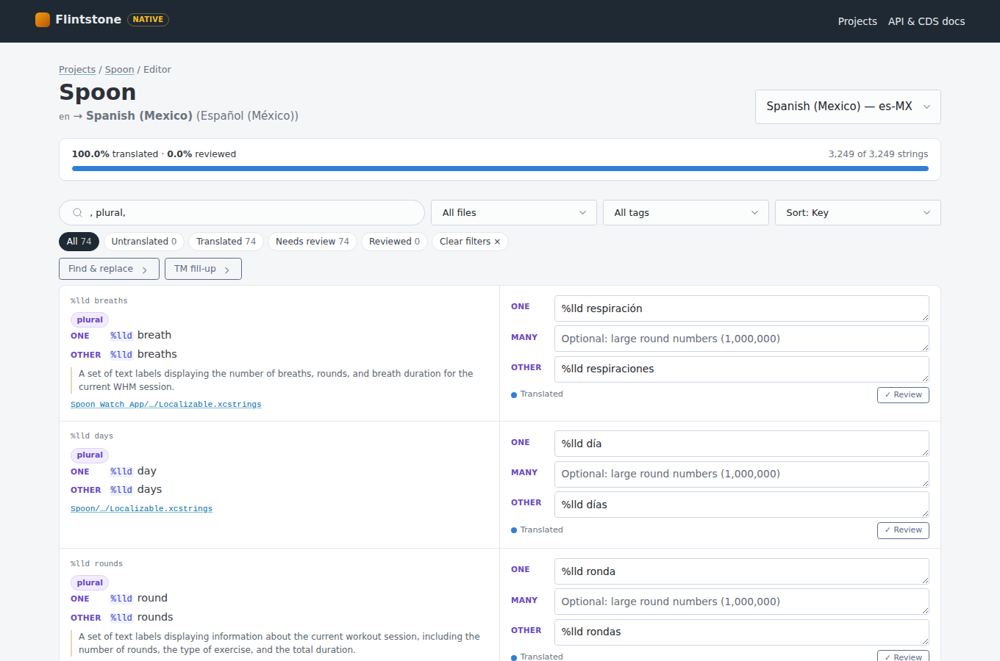
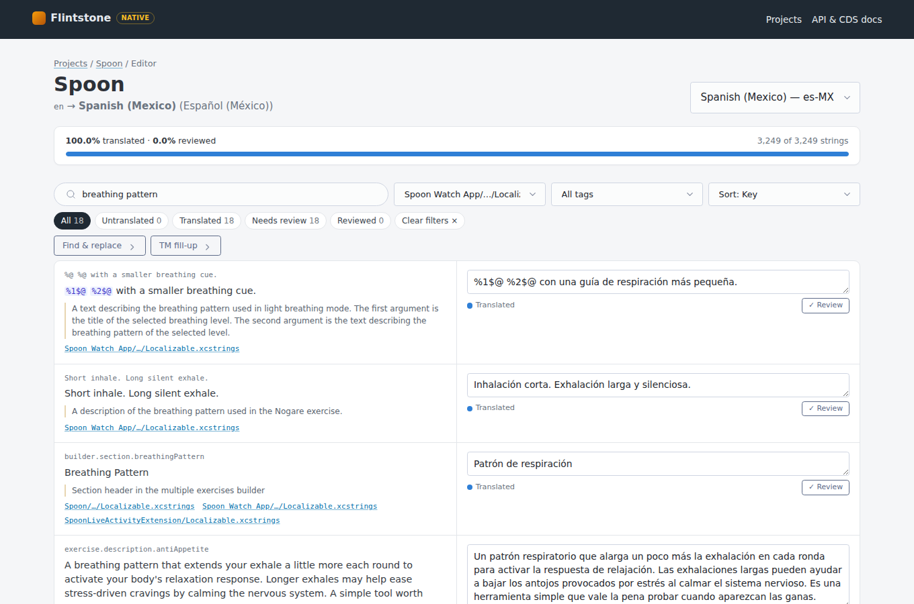

# Flintstone

**The smoothest, fastest translation management system you can self-host — and a drop-in Transifex Native backend.**

Flintstone is a lightweight, single-process TMS that gets out of your way. No Docker compose files, no external databases, no JavaScript build steps. Install it with pip, run one command, and start translating.

```bash
pip install -e .
flintstone            # or: python -m flintstone
# → http://localhost:8000
```

That's it. Your translations live in a single SQLite file. Back it up by copying one file. Deploy it on a $5 VPS, a Raspberry Pi, or a free-tier cloud instance.

Every project is also a **Transifex Native** resource. Flintstone serves a Content Delivery Service (CDS) at `/cds` that speaks the same protocol as Transifex's, so the official Transifex Native SDKs and CLIs (iOS, JavaScript, Python) work against it unchanged. Point their CDS host at Flintstone and you get over-the-air translations without a Transifex account.

---

## Why Flintstone?

Every TMS out there makes you choose: pay for a hosted service, or spend a week setting up an open-source behemoth with PostgreSQL, Redis, Elasticsearch, and a Node.js frontend.

Flintstone rejects that tradeoff. It's built on three principles:

1. **Zero friction** — One install command, one run command, zero configuration. No `.env` files to fill out, no databases to provision, no build steps to run.

2. **Speed over ceremony** — Inline editing with instant save. Translation memory suggestions appear as you focus a string. Find and replace across thousands of translations in milliseconds. Push 3,000 strings from an iOS app in under two seconds.

3. **Small footprint, full power** — Single SQLite file, single Python process. But it has everything a real TMS needs: multi-project management, over-the-air delivery, plurals, review workflow, TMX import/export, translation memory, tagging, bulk operations, and a complete REST API.

---

## Transifex Native, self-hosted

Transifex Native splits localization into three parts. Flintstone provides all of them:

| Transifex Native piece | In Flintstone |
|---|---|
| **Content Delivery Service** — SDKs fetch translations over the air, CLIs push source strings | `/cds`: languages, content (with tag/status filters and ETags), push jobs, invalidate/purge |
| **Native project** — public token + secret, source and target languages | Every project gets a token and a secret. Only the secret's hash is stored, so it is shown once |
| **Translation editor** — strings with developer comments, context, tags, occurrences, character limits, plurals | Web editor with plural forms, review status, filters by file/tag/status, TM suggestions |
| **CLI** — `txios-cli` / `txjs-cli` push and pull | `flintstone push / pull / invalidate`, which reads String Catalogs directly, so no Xcode is needed |

**Verified with the official tooling** (pointed at Flintstone, not Transifex):

| Tool | Checked |
|---|---|
| `@transifex/native` 8.0.3 (JS SDK) | `getLanguages`, `setCurrentLocale`, `t()` with keys, context and ICU plurals, `pushSource`, `invalidateCDS` |
| `@transifex/cli` 8.0.3 (`txjs-cli`) | `push` (metadata, `--dry-run`, `--purge`), `pull`, `invalidate` |
| `transifex-python` 3.7.0 | `fetch_translations` (including `If-None-Match` → 304), `translate`, `push_source_strings`, `invalidate_cache` |
| `transifex-swift` (iOS SDK) | Requests and payloads mirrored from the SDK source and covered by tests: key lookup, `{cnt, plural, …}` and `<cds-root>` formats, relative job links, `[String: String]` job errors |

### How strings are stored

Flintstone stores strings the way Transifex's iOS tooling sends them, so the iOS SDK can render them:

- **Keys** are the String Catalog keys, unchanged. The SDK looks translations up by the same key `NSLocalizedString` and SwiftUI's `Text` use.
- **Plural variations** become ICU: `{cnt, plural, one {%lld day} other {%lld days}}`. The editor shows one field per plural category of the target language, following CLDR.
- **Device variations and substitutions** become the SDK's intermediate `<cds-root><cds-unit id="device.iphone">…</cds-unit></cds-root>` XML. The editor shows one field per unit.
- **Occurrences** are the files a key was found in. **Developer comments** are the catalog comments.

---

## Quick start: localize an iOS app

This walkthrough uses [Spoon](https://github.com/geranuda/spoon), an iPhone + Apple Watch + Live Activity app that already ships English and Spanish (Mexico) through String Catalogs.

**1. Run Flintstone and create a project**

```bash
pip install -e .
flintstone
```

Open http://localhost:8000 → **New project**: name `Spoon`, source `en`, targets `es-MX`. Copy the token and secret it shows. You can also use the API: `POST /api/projects {"name": "Spoon", "source_language": "en", "target_languages": ["es-MX"]}`.

**2. Push the app's strings**

```bash
cd ~/code/spoon
export FLINTSTONE_CDS_HOST=http://localhost:8000/cds
export FLINTSTONE_TOKEN=1/…
export FLINTSTONE_SECRET=1/…
flintstone push --project Spoon.xcodeproj --with-translations
```

```
Found 3249 source strings in 3 file(s):
  Spoon/Localization/Localizable.xcstrings  (2745 strings)
  Spoon Watch App/Localization/Localizable.xcstrings  (1451 strings)
  SpoonLiveActivityExtension/Localizable.xcstrings  (809 strings)
Warning: 65 key(s) have different source text in different files; the first file listed wins.
✓ Source strings pushed: 3249 created, 0 updated, 0 skipped, 0 deleted, 0 failed
✓ es-MX translations: 3249 created, 0 updated, 0 skipped, 0 deleted, 0 failed
```

`--with-translations` imports the translations already in the catalogs. Use it once when moving an app that is already localized. Without it, `push` only sends source strings, like `txios-cli push`. Or do steps 1–2 in one go: `scripts/demo_push.sh ~/code/spoon/Spoon.xcodeproj Spoon es-MX`.

**3. See it.** Open http://localhost:8000/projects/1. It shows per-language progress, every file the strings came from, the push history, and ready-to-paste SDK snippets. The editor (`/projects/1/translate`) lists every string with its key, developer comment, occurrences and plural forms.







**4. Deliver translations over the air.** Add the [Transifex iOS SDK](https://github.com/transifex/transifex-swift) package to the app and initialize it with Flintstone as the CDS host (Spoon: `SpoonApp.init()`):

```swift
import Transifex

TXNativeBuilder()
    .setLocales(TXLocaleState(sourceLocale: "en", appLocales: ["en", "es-MX"]))
    .setToken("<project token>")
    .setCDSHost("https://flintstone.example.com/cds")
    .build()

TXNative.fetchTranslations()
```

The SDK swizzles `NSLocalizedString`, `Bundle.localizedString` and SwiftUI `LocalizedStringKey`, so views need no changes. For the watch app, repeat the setup in its `App`. For app extensions such as Live Activities, share the SDK cache through an App Group (`TXStandardCache.getCache(groupIdentifier:)`). Info.plist and Settings.bundle strings are managed by iOS and can't be delivered over the air, so `push` skips them unless you pass `--include-unsupported`.

**5. Ship translations with the build (optional)**

```bash
flintstone pull --output Spoon/                                 # txstrings.json: the SDK's offline bundle cache
flintstone pull --update-catalogs --project .                   # or write translations back into the .xcstrings files
```

`--update-catalogs` rewrites String Catalogs in Xcode's own JSON style and only touches changed entries. A round trip with no changes leaves the files byte-for-byte identical. This lets translations made in Flintstone ship even without the SDK.

---

## CLI

```
flintstone [serve]        Run the web server (default)
flintstone push           Push source strings (like txios-cli push / txjs-cli push)
flintstone pull           Download translations to txstrings.json and/or String Catalogs
flintstone invalidate     Force CDS cache invalidation
```

Credentials come from `--token` / `--secret` / `--cds-host` or `FLINTSTONE_TOKEN`, `FLINTSTONE_SECRET`, `FLINTSTONE_CDS_HOST`. The `TRANSIFEX_*` names work too, so existing scripts only need a new CDS host.

**`push`** reads String Catalogs (`.xcstrings`), `.strings` / `.stringsdict` in `.lproj` folders, XLIFF (for example from `xcodebuild -exportLocalizations`) and flat or nested JSON. Pass an `.xcodeproj`, a folder or files with `--project`. Flags follow `txios-cli`: `--append-tags`, `--excluded-files`, `--purge`, `--override-tags`, `--override-occurrences`, `--delete-translations`, `--dry-run`, `--source-locale`. Flintstone adds `--with-translations`, `--override-translations` and `--include-unsupported`.

Keys found in several files are merged, and their occurrences are combined. If a key's source text differs between files, the largest catalog (usually the main app) wins and `push` lists the conflicts.

**`pull`** accepts `--translated-locales` (default: every project language), `--output`, `--with-tags-only`, `--with-status-only`, `--ignore-missing-locales`, `--update-catalogs` and `--project`.

---

## Features

### Translation Editor
One target language at a time, the way translators work. Each string shows its key, source text with highlighted placeholders (`%@`, `%1$lld`, `{name}`), developer comment, context, character limit, tags and the files it occurs in. Plurals get one field per plural category of the target language. Translations save when you leave the field. `Ctrl+S` saves, `Ctrl+Enter` saves and jumps to the next string. You can filter by search (keys, source, translations, comments), file, tag and status (untranslated / needs review / reviewed), with counts that follow the filters.

### Review workflow
Translations are `translated`, `reviewed` or `proofread`. Mark strings reviewed in the editor. Editing a reviewed translation, or pushing a new source text, sends it back for review. SDKs can fetch only reviewed content with `filter[status]=reviewed`.

### Translation Memory
Every translation you save or import is stored in the translation memory. When you focus a string, Flintstone suggests translations from your TM, exact matches first and then substring matches. The TM is bidirectional: translate English→Spanish and you also get Spanish→English suggestions for free.

### TM Fill-up
Got a partially translated project? Hit the TM Fill-up button, pick your source and target languages, and Flintstone auto-fills every untranslated key that has an exact match in your translation memory. One click to leverage all your past work.

### Find & Replace
Global find and replace across all translations in a project. Preview matches with a before/after diff before applying. Filter by language to replace only in specific translations.

### Tagging
Organize strings with tags like `ui`, `emails`, `errors`, or add them at push time with `--append-tags`. Filter the editor by tag. SDKs can fetch only tagged strings with `filter[tags]=…`.

### Import & Export
Move translations in and out with industry-standard formats:

| Format | Import | Export | Use Case |
|--------|--------|--------|----------|
| **String Catalogs / .strings / .stringsdict / XLIFF** | `flintstone push` | `flintstone pull --update-catalogs` | Apple platforms |
| **txstrings.json** | — | `flintstone pull` | Transifex iOS SDK offline bundle |
| **JSON** | Per language | Per language | Developer integration, i18n libraries |
| **CSV** | All languages | All languages | Spreadsheet editing, bulk review |
| **TMX 1.4** | Project or TM | Project or TM | CAT tool interop, translation memory exchange |

### REST API
Every feature is available through the API. The web UI is just a client. Build your own integrations, CI/CD pipelines, or custom workflows.

Full interactive API docs at `/api/docs` (Swagger UI) and `/redoc` (ReDoc), including the CDS endpoints.

### Multi-Project
Manage multiple translation projects from one dashboard. Each project has its own source language, target languages, credentials and completion stats. Translation memory is shared across projects: translate "Save" once, and every project benefits.

---

## Architecture

```
Python 3.10+ / FastAPI / SQLAlchemy / SQLite
Jinja2 templates / Pico CSS (vendored) / a little vanilla JS
No npm. No webpack. No Docker required.
```

| Component | Choice | Why |
|-----------|--------|-----|
| Web framework | FastAPI | Async, fast, auto-generates API docs |
| Database | SQLite (WAL mode) | Zero setup, single file, surprisingly fast |
| ORM | SQLAlchemy 2.0 | Industry standard, type-safe |
| Templates | Jinja2 | Server-rendered, no JS build step |
| CSS | Pico CSS | Minimal, looks good by default; served locally so the UI works offline |
| Server | uvicorn | Production-grade ASGI server |
| CLI HTTP | Python standard library | `flintstone push/pull` adds no dependencies |

Existing databases are upgraded in place on startup: new columns are added and projects get a CDS token.

---

## Configure (optional)

All settings via environment variables:

```bash
FLINTSTONE_DB="sqlite:///path/to/data.db"  # Database location
FLINTSTONE_HOST="0.0.0.0"                   # Bind address
FLINTSTONE_PORT="8000"                       # Port
FLINTSTONE_DEBUG="true"                      # Auto-reload on code changes
```

Mobile apps must be able to reach the CDS. For production, put Flintstone behind HTTPS (for example Caddy or nginx) and use `https://your-host/cds` as the CDS host.

## Test

```bash
pip install -e ".[dev]"
python -m pytest tests/ -v
```

118 tests covering the CDS protocol, push and pull semantics, String Catalog, `.strings`, `.stringsdict`, XLIFF and JSON parsing and write-back, the CLI, database upgrades, the web UI, import/export round-trips, translation memory, find & replace, tagging, and TM fill-up.

---

## API Overview

### Content Delivery Service (Transifex Native protocol)
```
GET    /cds/languages                  Project languages (Bearer token)
GET    /cds/content/{lang}             Translations; ?filter[tags]=a,b  ?filter[status]=reviewed; ETag/304
POST   /cds/content                    Push source strings (Bearer token:secret) → 202 + job link
GET    /cds/jobs/content/{id}          Push job status and details
POST   /cds/content/{lang}             Import existing translations (Flintstone extension)
POST   /cds/invalidate[/{lang}]        Invalidate cached content
POST   /cds/purge[/{lang}]             Purge cached content
GET    /cds/health                     Health check
```

### Projects
```
GET    /api/projects                   List projects
POST   /api/projects                   Create project (source/target languages; returns token + secret once)
GET    /api/projects/{id}              Get project
PUT    /api/projects/{id}              Update project
DELETE /api/projects/{id}              Delete project
GET    /api/projects/{id}/languages    Source + target languages
POST   /api/projects/{id}/languages    Add target language
DELETE /api/projects/{id}/languages/{code}   Remove target language (translations are kept)
POST   /api/projects/{id}/credentials  Rotate secret and/or token
GET    /api/projects/{id}/jobs         Push history
```

### Languages
```
GET    /api/languages             List languages
POST   /api/languages             Add language
DELETE /api/languages/{id}        Remove language
```

### Translation Keys
```
GET    /api/projects/{id}/keys         List keys (?q=search&tag=ui)
POST   /api/projects/{id}/keys         Create key (tags, context, character limit, occurrences)
PUT    /api/keys/{id}                  Update key
DELETE /api/keys/{id}                  Delete key
GET    /api/projects/{id}/tags         List all tags
GET    /api/projects/{id}/strings      Editor view: ?lang=es-MX&q=&tag=&status=&file=&sort=&page=
```

### Translations
```
GET    /api/projects/{id}/translations          List all translations
PUT    /api/translations/{key_id}/{lang_id}     Set translation (optional status)
PUT    /api/translations/{key_id}/{lang_id}/status   Mark translated / reviewed / proofread
DELETE /api/translations/{key_id}/{lang_id}     Remove translation
POST   /api/projects/{id}/translations/bulk     Bulk update
GET    /api/projects/{id}/translations/search   Search keys and values
POST   /api/projects/{id}/translations/find-replace  Find & replace
```

### Import / Export
```
GET    /api/projects/{id}/export           Export (JSON or CSV)
POST   /api/projects/{id}/import           Import (JSON or CSV)
GET    /api/projects/{id}/export/tmx       Export as TMX
POST   /api/projects/{id}/import/tmx       Import TMX
```

### Translation Memory
```
GET    /api/memory/suggest                 Get TM suggestions
GET    /api/memory                         List TM entries
DELETE /api/memory                         Clear TM
POST   /api/memory/fillup/{project_id}     Auto-fill from TM
POST   /api/memory/import/tmx              Import TMX to TM
GET    /api/memory/export/tmx              Export TM as TMX
```

### Stats
```
GET    /api/projects/{id}/stats            Per-language translated / reviewed counts
```

---

## Project Structure

```
flintstone/
├── __init__.py              # Version
├── __main__.py              # python -m flintstone
├── app.py                   # FastAPI app with lifespan
├── cli.py                   # flintstone serve / push / pull / invalidate
├── client.py                # Standard-library CDS client used by the CLI
├── catalogs.py              # .xcstrings / .strings / .stringsdict / XLIFF / JSON readers, catalog write-back
├── native.py                # Credentials, project languages, push/pull logic
├── icu.py                   # ICU plurals and <cds-root> variations
├── locales.py               # Language names, text direction, CLDR plural categories
├── editor.py                # Editor queries and view models
├── config.py                # Settings from env vars
├── database.py              # SQLite + SQLAlchemy setup, in-place schema upgrades
├── models.py                # ORM models
├── schemas.py               # Pydantic request/response schemas
├── api/
│   ├── cds.py               # Transifex Native CDS (/cds)
│   ├── projects.py          # Projects, languages, credentials, push history
│   ├── languages.py         # Language CRUD
│   ├── translations.py      # Keys, translations, review status, strings, find & replace, tags
│   ├── export.py            # JSON/CSV import & export
│   ├── tmx.py               # TMX import & export
│   └── memory.py            # Translation memory + TM fill-up
├── ui/
│   └── views.py             # HTML page routes
├── templates/               # Jinja2 templates (dashboard, project, editor, import/export)
└── static/
    ├── app.css, app.js      # Styles, copy buttons, shortcuts
    ├── editor.js            # Autosave, plural forms, review, TM suggestions
    └── vendor/pico.min.css  # Pico CSS 2.1.1 (MIT)
scripts/
└── demo_push.sh             # Create a project and push an app into it
```

---

## Roadmap

- **Authentication**: user accounts for the web UI and admin API. The CDS already uses per-project tokens and secrets.
- **Revision history**: track who changed what and when
- **Glossary**: enforce consistent terminology across projects
- **Webhook notifications**: notify when translations are updated
- **Android and web file formats in `flintstone push`**: `strings.xml`, PO
- **Fuzzy TM matching**: Levenshtein distance for smarter suggestions
- **Machine translation integration**: optional MT pre-translation via external APIs

---

## License

MIT

---

*Flintstone — because translation management shouldn't require a DevOps team.*
